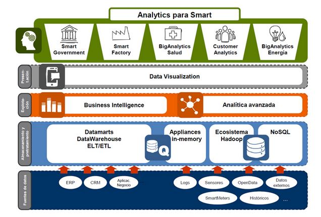

Inteligencia de negocio
=======================

Preguntas sesión 1
------------------

Pregunta 1: Me gustaría que comentárais esta arquitectura de solución que se
plantea en la imagen. Estáis de acuerdo? que es Bigdata? BI? BA?

Respuesta:

Pregunta 2: En no mas de 5 líneas, resumir los paradigmas de diseño de Bill
Inmon vs. Ralph Kimball

Respuesta: Según Immon,  la forma ideal para la explotación de datos en una
organización es crear, a partir de las diferentes fuentes de datos un
Datawarehouse único y centralizar en el todos los datos. Posteriormente se
crearían los datamarts para cada departamento (o necesidad de negocio) a partir
de este DW.

Por el contrario, Kimball plantea que el Ddatawarehouse no debe crearse como
tal, sino que a partir de los datos se van creando distintos cubos Olap según
las necesidades de la organización y se van uniendo estos cubos por los datos
que tengan en común. Para la creación de los cubos, los datos deben pasar por
una zona de staying que es donde se centralizan los datos obtenidos de
diferentes fuentes.s
